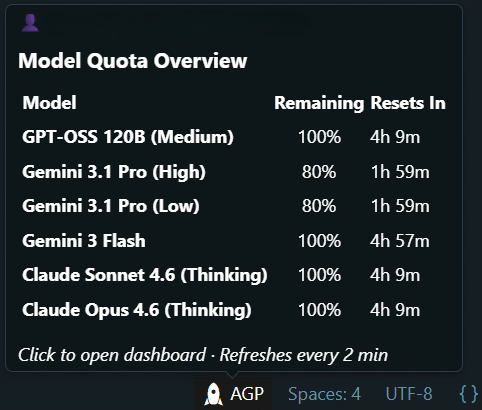
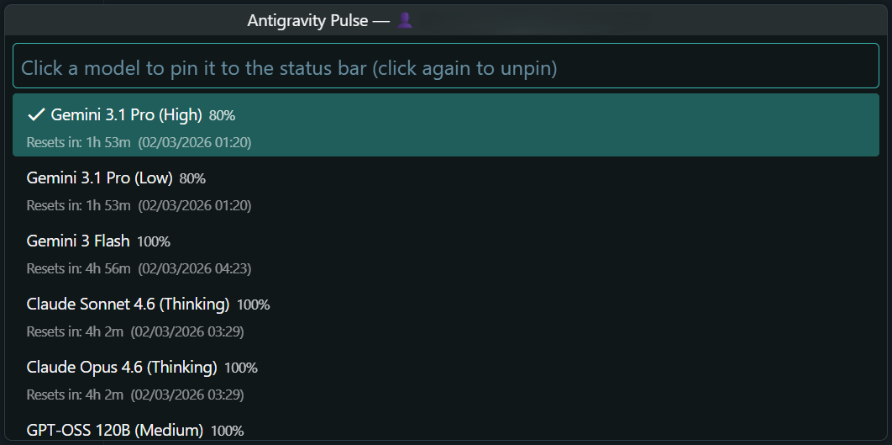

<h1 align="center">
  <br/>
  Antigravity Pulse
</h1>

<p align="center">
  <b>A lightweight, privacy-first quota monitor for Antigravity AI models.</b><br/>
  See your remaining Gemini & Claude limits — directly in your status bar, without leaving your code.
</p>

<p align="center">
  
  
  
  
</p>

<p align="center">
  <a href="https://github.com/AyanMemon296">
    
  </a>
  <a href="https://www.youtube.com/@ayanmemon2926">
    
  </a>
  <a href="https://www.linkedin.com/in/ayanmemon296/">
    
  </a>
</p>

---

## Why I Built This

I was frustrated. In 2026, the VS Code / Antigravity marketplace is full of extensions that promise to show you your AI quota — but many of them are:

- **Scrapers** quietly stealing your CSRF tokens to use your Claude 4 / Gemini 3 Pro credits on someone else's server.
- **Bloated** extensions that open OAuth popups, store tokens, and make external API calls just to display a number.
- **Broken** — because they hard-code a process name that Antigravity keeps changing between updates.

As a Computer Engineering student, I built **Antigravity Pulse** the right way:

- **Zero external calls.** It queries the Antigravity language server running locally on your own machine. Your credentials never leave your computer.
- **Zero login required.** It reads the CSRF token the IDE already has in memory — no OAuth, no browser popups.
- **Zero bloat.** The extension is a single file. It uses no bundler, no framework, and runs once every 2 minutes.

---

## Preview

  
_Quick view of all model quotas on hover._

  
_Searchable dashboard with exact reset times._

---

## Features

| Feature                 | Description                                                                                           |
| ----------------------- | ----------------------------------------------------------------------------------------------------- |
| 🚀 **Status Bar Tab**   | Shows `AGP` in your status bar like a native IDE tab. Click to open the dashboard.                    |
| 🧲 **Model Pinning**    | Click any model in the dashboard to pin its live percentage to the status bar. Click again to unpin.  |
| 📊 **Hover Tooltip**    | Hover over the status bar for a full 2-column table: model name, remaining %, and countdown to reset. |
| 🗂️ **Dashboard**        | Opens a searchable Quick Pick panel with exact reset timestamps for all 6 models.                     |
| 🔄 **Auto Refresh**     | Polls every 2 minutes automatically.                                                                  |
| 🔴 **Graceful Offline** | If Antigravity is not running, it shows `AGP Offline` silently — no error popups.                     |
| 🔒 **Privacy-First**    | All data comes from your local `language_server_windows_x64.exe`. Nothing is sent anywhere.           |

---

## How It Works

Antigravity runs a local HTTPS language server (`language_server_windows_x64.exe`) in the background. This server exposes a private gRPC-JSON endpoint that contains your account info and quota data.

Antigravity Pulse:

1. **Finds** the language server process using `Get-CimInstance Win32_Process` (Windows) or `ps` (macOS/Linux).
2. **Extracts** the dynamic CSRF token from its command-line arguments.
3. **Discovers** its listening HTTPS port using `Get-NetTCPConnection`.
4. **Requests** `POST /exa.language_server_pb.LanguageServerService/GetUserStatus` with the CSRF token.
5. **Parses** the quota fractions and reset times from `userStatus.cascadeModelConfigData.clientModelConfigs`.

The connection uses `rejectUnauthorized: false` because the local server generates a self-signed TLS certificate dynamically — this is intentional and safe since the connection never leaves `127.0.0.1`.

---

## Supported Models

- Gemini 3.1 Pro (High)
- Gemini 3.1 Pro (Low)
- Gemini 3 Flash
- Claude Sonnet 4.6 (Thinking)
- Claude Opus 4.6 (Thinking)
- GPT-OSS 120B (Medium)

---

## Installation

### From the Marketplace

1. Search **Antigravity Pulse** in the Antigravity Extensions panel.
2. Click **Install**.
3. Your quota appears in the bottom-right status bar automatically.

### From Source

```bash
git clone https://github.com/AyanMemon296/antigravity-pulse-extension.git
cd antigravity-pulse-extension
npm install
npm run compile
```

Then press **F5** in Antigravity to launch the Extension Development Host.

---

## Requirements

- **Antigravity IDE** (Windows, macOS, or Linux)
- The Antigravity language server must be running (it starts automatically with the IDE)
- Node.js 18+ (for development only)

---

## Project Structure

```
src/
  api.ts          ← Process discovery, port probing, HTTPS request, payload parsing
  extension.ts    ← Status bar, tooltip, dashboard QuickPick, refresh loop
assets/
  icon.png        ← 128×128 extension icon
```

---

## Extension Settings

This extension contributes the following settings:

- `antigravity-pulse.refreshInterval`: Set the quota polling interval in milliseconds (default is `120000` or 2 minutes).
- `antigravity-pulse.showNotifications`: Enable or disable error notifications when the language server is unreachable.

---

## Troubleshooting & Known Issues

- **"AGP Offline" Status:** This usually means the Antigravity Language Server hasn't finished booting up. Give it 10-15 seconds after opening the IDE.
- **VPN/Proxy:** If you are using a strict system-wide proxy, ensure `127.0.0.1` is whitelisted, or the extension won't be able to "talk" to the IDE.

---

## Security Notes

- **No outbound network requests.** Every HTTP call targets `127.0.0.1` only.
- **Secure OS Keychain Isolation.** Credentials and session tokens are stored defensively using the VS Code `SecretStorage` API (bound to your OS Keychain).
- **Strict Rate Limiting.** To prevent potential API abuse flags, the extension enforces a hard limit of no more than one background check every 10 seconds.
- **No telemetry.** The extension collects and sends zero data.
- The `rejectUnauthorized: false` flag is required to connect to the IDE's dynamically-generated self-signed certificate. It does not weaken any real security because the connection is strictly loopback-only.

---

## 👤 About the Creator

- **Created by:** Ayan Memon
- **GitHub:** [AyanMemon296](https://github.com/AyanMemon296)
- **YouTube:** [@ayanmemon2926](https://www.youtube.com/@ayanmemon2926)
- **LinkedIn:** [Ayan Memon](https://www.linkedin.com/in/ayanmemon296/)

---

## License

[MIT](LICENSE)
